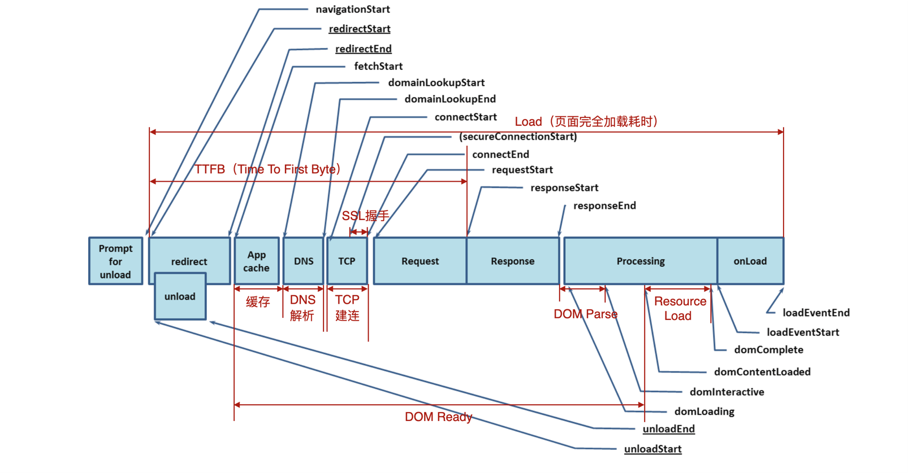

# 性能分析

## 基本概念

通过对页面的各加载阶段耗时、资源加载、包体积、网络请求、性能 trace 等方面进行分析，找出页面性能瓶颈，并进行优化。

## 明确当前性能水位

重点关注以下指标，注意需要拆开安卓和 iOS 分别进行统计，因为双端的性能瓶颈可能并不相同：

- 秒开率；
- FMP；

## 各加载阶段耗时

重点关注以下指标，注意需要拆开安卓和 iOS 分别进行统计，因为双端的性能瓶颈可能并不相同：

- DNS：考虑 DNS 预热进行优化；
- TCP：考虑 预建连 进行优化；
- Response：
- Processing：
- DOM Parse：
  - HTML 文档结构复杂或者包含大量的节点，可能导致 DOM 解析时间较长；
  - 阻塞性的 JavaScript 脚本（如同步加载的脚本）可能会影响 DOM 解析；
- Resource Load：

## 资源加载

重点关注以下指标，注意需要拆开安卓和 iOS 分别进行统计，因为双端的性能瓶颈可能并不相同：

- 主模板/子资源离线化率；
- preload 命中率；

可能导致性能瓶颈的原因：

- 子包拆得过细，导致需要发起多次网络请求以获得子资源；

## 包体积

- 是否存在重复的依赖，项目里同时安装了不同版本的同一个依赖，可以通过 `package.json` 的 `resolution` 配置以统一依赖的版本；
- 主模板文件/JS 文件是否体积过大，可以考虑通过拆包进行优化，将首屏渲染依赖的代码单独拆成一个文件，其他与首屏无关的代码都可以延后再加载；

## 网络请求

- 对于首屏渲染依赖接口数据的页面，可以通过 prefetch 进行优化；
  - 关注 prefetch 命中率是否偏低：
    - 将 prefetch.js 文件离线化，并且关注离线化率是否偏低；
    - 优化 prefetch.js 文件体积，尽可能精简，减少文件加载时间，提升 prefetch 命中率；
- 首屏直出：缓存接口数据，在用户进入页面时先使用缓存数据进行直出渲染，等接口返回后再用真实数据进行局部更新；
  - 注意根据业务特性设定缓存时长，比如一些以月为维度访问的业务，缓存时长可以考虑设置为 30 天；（不过也需要考虑到过长的缓存时长导致影响用户体验和客诉上升）

## 性能 trace

通过 Google 提供的 perfetto 工具对页面进行单点性能分析，检查页面加载过程中是否存在不合理的长任务，或其他造成线程阻塞的情况；
