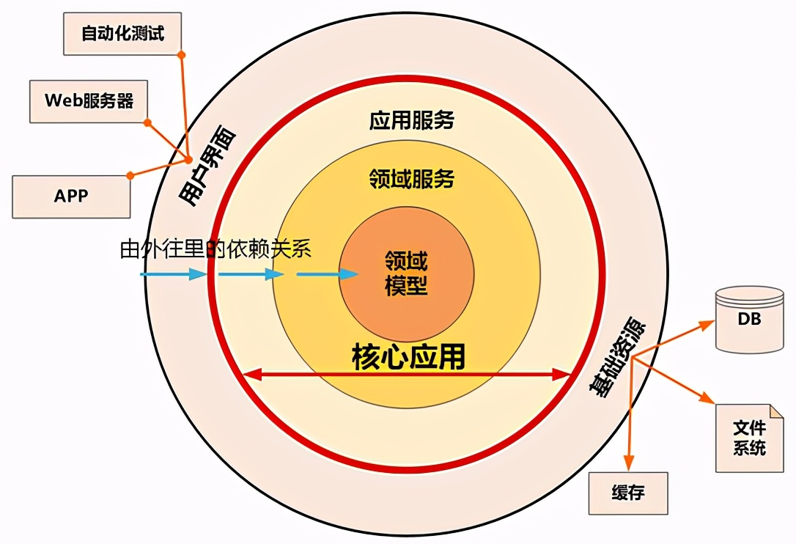

# 洋葱模型

洋葱模型强调核心业务逻辑和外部依赖之间的分离，并鼓励将代码组织成可维护的、松耦合的同心层。

- **核心与外围**：洋葱模型的中心是核心业务逻辑，这是软件的最重要部分，通常不依赖于外部系统或库。外围层则包含与外部系统（如数据库、API、文件系统等）的交互，这些层离核心越远，依赖性越高。

- **依赖的方向**：每一层只能依赖其内部的层，不能依赖其外部的层。这意味着如果你有一个三层结构（内层、中层和外层），中层可以依赖内层，但不能依赖外层。这确保了代码的高内聚和低耦合。

- **测试**：由于依赖的方向性，内层的代码可以更容易地进行单元测试，因为它们不依赖于外部系统。外层代码则可能需要进行集成测试，因为它们与外部系统有交互。

- **在 Node.js 中的应用**：在 Node.js 项目中，洋葱模型可以通过模块和依赖注入来实现。例如，你可以将核心业务逻辑放在一个模块中，然后将这个模块注入到依赖外部系统的模块中。这样，核心业务逻辑就不直接与外部系统交互，而是通过注入的模块进行交互。

- 优点：

  - 可维护性：由于代码是分层和松耦合的，所以更容易维护和修改。

  - 可测试性：由于依赖的方向性，可以更容易地进行单元测试。

  - 灵活性：由于核心业务逻辑与外部系统的分离，可以更容易地替换或添加外部系统。

  - 挑战：实施洋葱模型可能需要一些重构工作，特别是对于那些已经有大量代码的现有项目。此外，需要确保开发团队理解并遵循这种架构风格。
